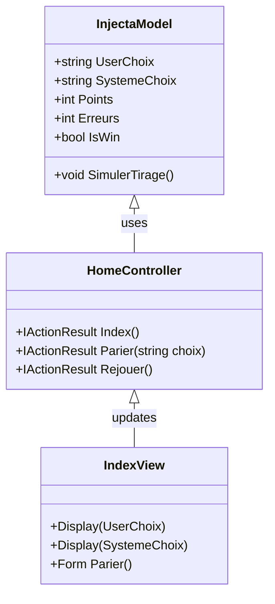
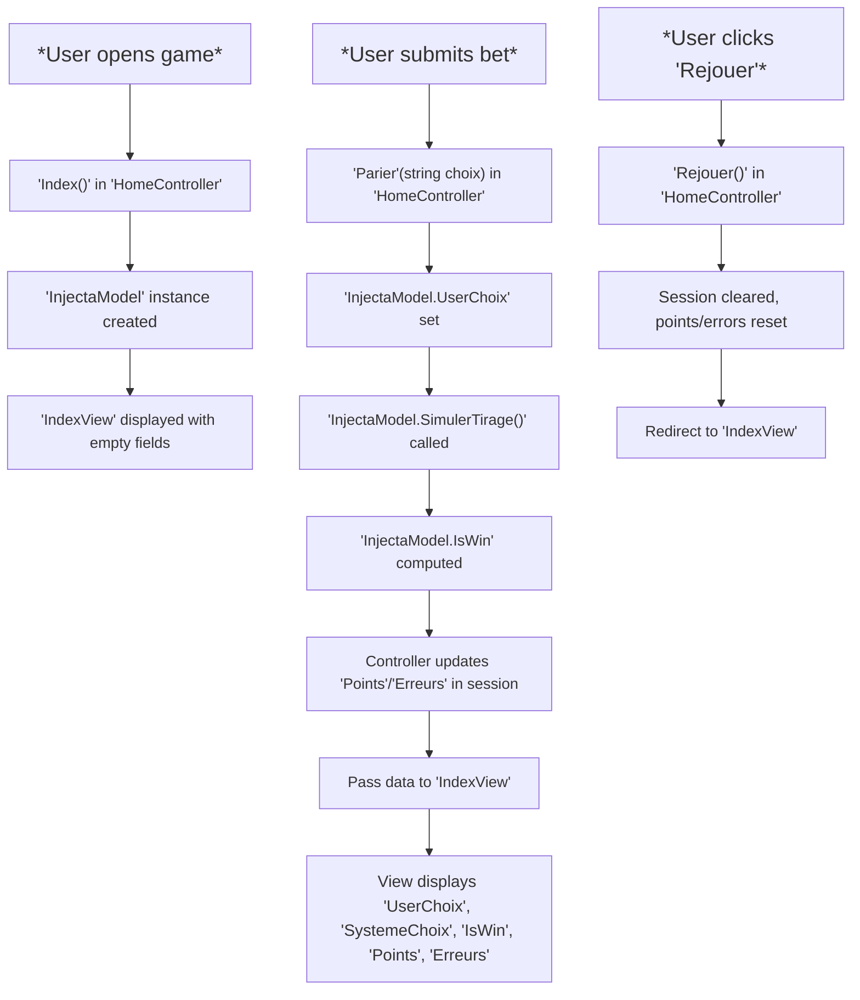

# Ce que j'ai prises:
## - Travaille sur un système de points et logique de score
## - Utilise LINQ
## - Gestion d’interactions avec des message boxes et des boutons

---
---

# What I have taken:
## - Working on a points system and scoring logic
## - Uses LINQ
## - Handling interactions with message boxes and buttons

# Classes

# Flowchart

